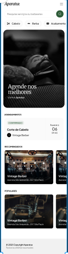

# Aparatus

Uma aplicação de agendamento e gestão de serviços para barbearias, construida com **Next.js**, **Prisma**, **Stripe** e **Tailwind CSS**.

## Visão geral

- Pagina inicial com destaques de serviços e agendamentos confirmados.
- Listagem de barbearias e serviços disponiveis.
- Reservas online com checkout seguro via Stripe.
- Painel de agendamentos para acompanhar status e detalhes.
- Integração com banco de dados PostgreSQL via Prisma.
- Chat usando IA para fazer agendamentos.

## Tecnologias

- **Next.js 16**
- **React 19**
- **Tailwind CSS 4**
- **Prisma 7**
- **PostgreSQL**
- **Stripe**
- **React Query**
- **Zod**
- **Radix UI**
- **Sonner**

## Estrutura do projeto

- `app/` � paginas, rotas e API routes do Next.js.
- `components/` � componentes da interface reutiliz�veis.
- `lib/` � utilitários, cliente Prisma e lágica de autenticação.
- `hooks/` � hooks personalizados de dados.
- `prisma/` � esquema do banco e seed de dados.
- `public/` � imagens e ativos estáticos.

## Como rodar localmente

1. Instale as dependencias:

```bash
npm install
```

2. Renomeie o arquivo `.env.example` para `.env` e defina as variaveis de ambiente.:

```env
DATABASE_URL=""
BETTER_AUTH_SECRET=USZFLpuozxsYxmU7Mgv4sFRwQDARtRlx
BETTER_AUTH_URL=http://localhost:3000 # Base URL of your app
NEXT_PUBLIC_APP_URL="http://localhost:3000"

GOOGLE_CLIENT_SECRET=""
GOOGLE_CLIENT_ID=""

GOOGLE_GENERATIVE_AI_API_KEY=""
OPENAI_API_KEY=""

NEXT_PUBLIC_STRIPE_PUBLISHABLE_KEY=""
STRIPE_SECRET_KEY=""
STRIPE_WEBHOOK_SECRET_KEY="whsec_1dcaac1b3cf8c1570e0d82254de342a984240cd58b21c84fb57ddd12b915200b"
```

3. Gere as tabelas do prisma no seu banco de dados:

```bash
npx prisma db push 
```

4. Gere as tipagens do banco:

```bash
npx prisma generate
```

5. Gere dados ficticios para começar a usar a aplicaçaõ:

```bash
npx prisma db seed
```

6. Execute a aplicação:

```bash
npm run dev
```

## Scripts úteis

- `npm run dev` � inicia o servidor de desenvolvimento.
- `npm run build` � gera a versão de produção.
- `npm run start` � inicia o servidor Next.js em produção.
- `npm run lint` � roda o ESLint.

## Observações

- O projeto usa `public/apa.png` para a imagem principal do README.
- Ajuste as rotas do Stripe e as chaves de ambiente conforme o seu ambiente.

## Licença

Projeto criado para fins de estudo.
